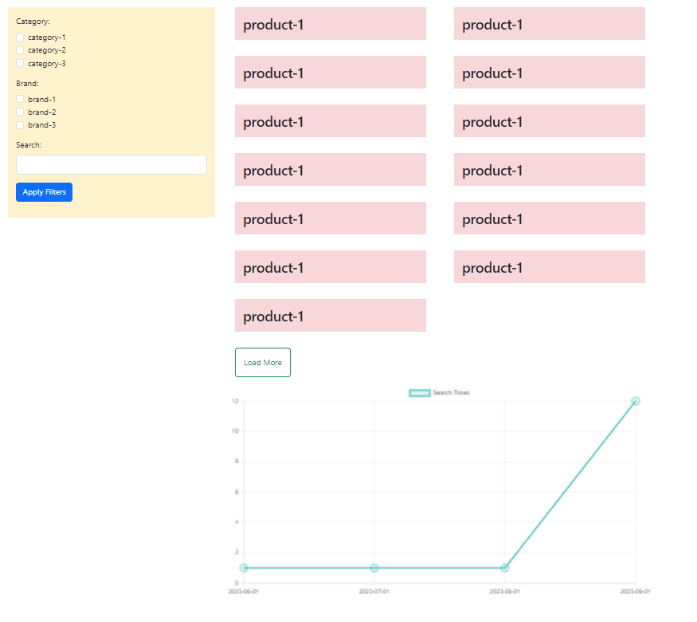

## Products Page "using Laravel, Ajax, chart.js"

### Scenario Details
> create products page to show all items from dummy.sql using ajax with loadmore ajax button.
create filter form with distinct values of category , brands checkboxes
add an input text to filter form to search for products that matches same name or same category or same brand name

Used Plugins:
- [Charts Plugin](https://www.chartjs.org/docs/latest/samples/information.html)

  - show Point Styling chart for product search times: 
  [Point Styling chart](https://www.chartjs.org/docs/latest/samples/line/point-styling.html)

### Features

- Show all products
- Load more button
- Filter by category, brands checkbox
- Search on products that matches same name or same category or same brand name

